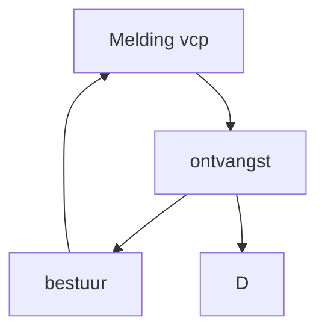
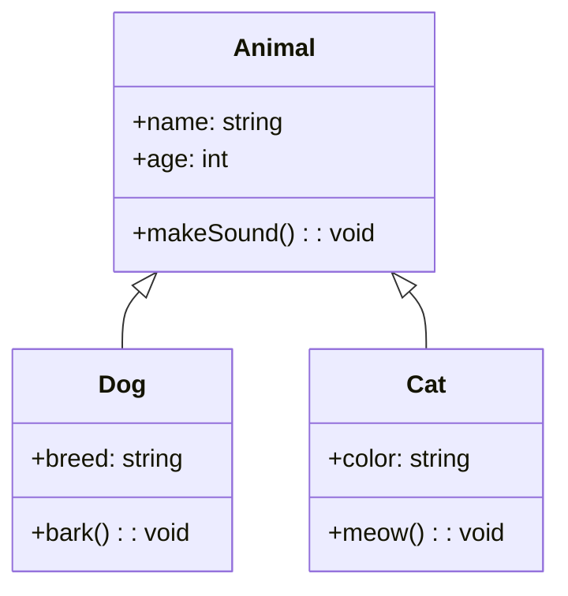
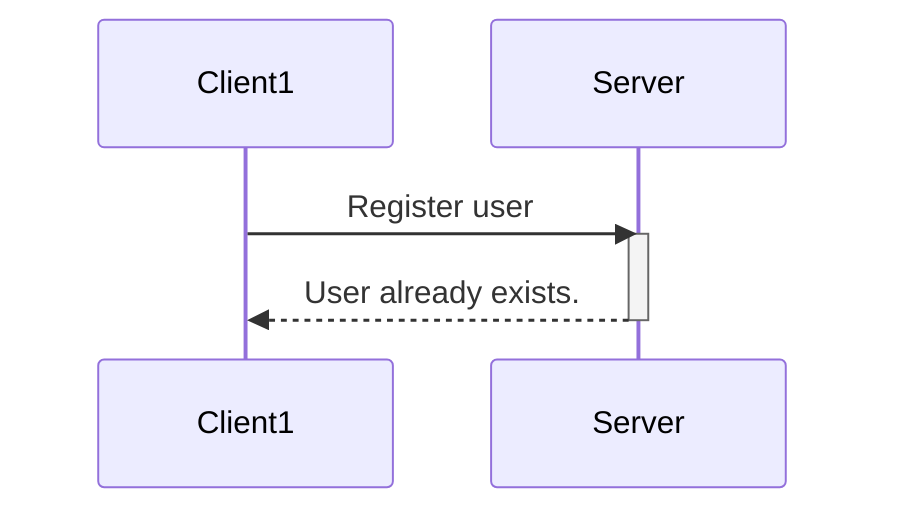

# Mermaid testing
https://www.freecodecamp.org/news/diagrams-as-code-with-mermaid-github-and-vs-code/
::: mermaid
graph TD;
    A-->B;
    A-->C;
    B-->D;
    C-->D;
:::

```mermaid
graph TD;
    A[Melding vcp] --> B[ontvangst];
    B-->C[bestuur];
    B-->D;
    C-->A;
```

```mermaid
classDiagram
    class Animal {
        +name: string
        +age: int
        +makeSound(): void
    }

class Dog {
    +breed: string
    +bark(): void
}

class Cat {
    +color: string
    +meow(): void
}

Animal <|-- Dog
Animal <|-- Cat
```

```mermaid
sequenceDiagram
    participant Client1
    participant Server
    Client1->>Server: Register user
    activate Server
    Server-->>Client1: User already exists.
    deactivate Server
```
